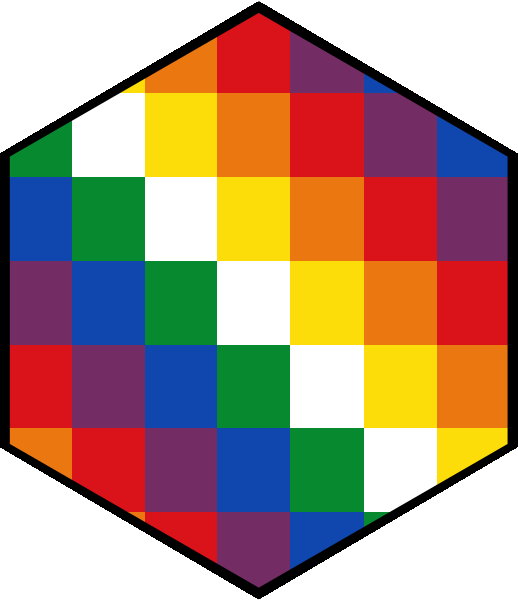
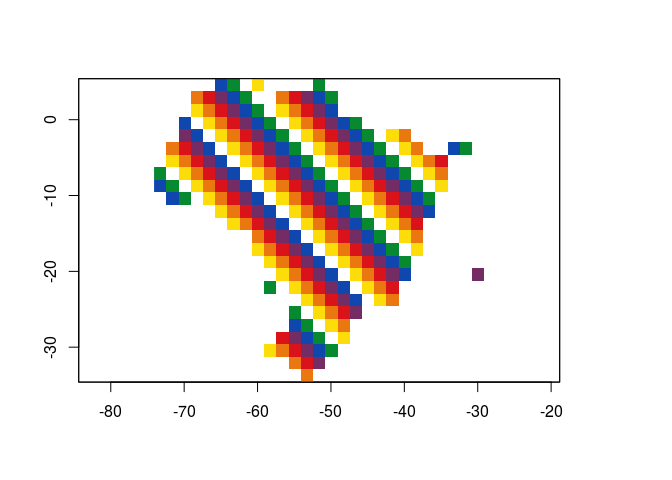

<!-- README.md is generated from README.Rmd. Please edit that file -->

# whipala



<!-- badges: start -->

<!-- badges: end -->

El objetivo de **whipala** es crear una paleta con los colores de la
whipala andina, y disponibilizarla para su uso en R.

## Instalación

Puede instalar **whipala** desde su repositorio en GitHub con el paquete
**remotes**

``` r
remotes::install_github("liibre/whipala")
```

## Ejemplo

    #> Loading whipala

``` r
library(whipala)
```

``` r
## basic example code
whipala()
```


    #> class      : RasterLayer 
    #> dimensions : 7, 7, 49  (nrow, ncol, ncell)
    #> resolution : 25.71429, 25.71429  (x, y)
    #> extent     : -90, 90, -90, 90  (xmin, xmax, ymin, ymax)
    #> crs        : +proj=longlat +datum=WGS84 +ellps=WGS84 +towgs84=0,0,0 
    #> source     : memory
    #> names      : layer 
    #> values     : 1, 7  (min, max)
    whipala(ncol = 13)


    #> class      : RasterLayer 
    #> dimensions : 13, 13, 169  (nrow, ncol, ncell)
    #> resolution : 13.84615, 13.84615  (x, y)
    #> extent     : -90, 90, -90, 90  (xmin, xmax, ymin, ymax)
    #> crs        : +proj=longlat +datum=WGS84 +ellps=WGS84 +towgs84=0,0,0 
    #> source     : memory
    #> names      : layer 
    #> values     : 1, 7  (min, max)

``` r
if (!dir.exists("outputs")) {dir.create("outputs")}
br <- raster::getData(name = "alt", country = "BRA", path = "outputs")
br <- raster::aggregate(br, 200)
whipala_map(br)
```



La Whipala es propiedad de la nación originaria, es decir de los
Qhishwa-Aymaras, Guaraníes y de todo el pueblo

Viva Bolivia, viva la Minga en Colombia, no al Marco Temporal en Brasil
y no al genocidio de los pueblos indígenas en toda Sudamérica.

## W(H)IP

  - \[x\] Reorganizar la matriz para plotar en el orden correcto, o
    cambiar la manera de plotar.
  - \[x\] Crear rasters em vez de grids
  - \[x\] Crear mapas con la whipala \#goals
  - \[x\] Mejorar el violeta
  - \[x\] Transformar colores a hex codes para transformar en paleta
    (whipalette :P)
  - \[x\] Hacer que la whipala original sea cuadrada
  - \[ \] Mejorar descripciones y fuentes
  - \[x\] Crear el logo del paquete

Si desea recrear el hermoso logotipo del paquete, use los siguientes
comandos:

``` r
library(hexSticker)

# Creando y guardando la bandera de whipala
if (!dir.exists("figs")) {dir.create("figs")}
png(filename = "figs/whipala_flag.png", bg = "transparent")
whipala(axes = FALSE, box = FALSE)
dev.off()

# Definición la url de la imagen
imgurl <- "figs/whipala_flag.png"

sticker(imgurl,
        package = "",
        s_x = 1.05,
        s_y = .95,
        s_width = 1.4,
        h_color = "black",
        white_around_sticker = TRUE,
        filename = "figs/whipala_logo.png")
```
