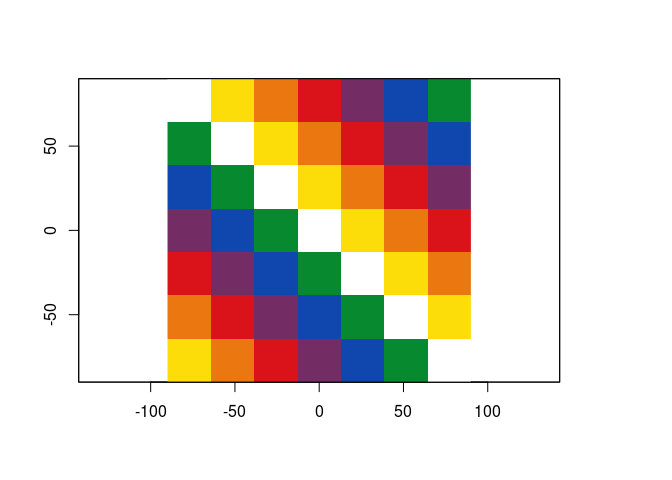

<!-- README.md is generated from README.Rmd. Please edit that file -->

# whipala

<!-- badges: start -->

<!-- badges: end -->

El objetivo de **whipala** es crear una paleta con los colores de la
whipala andina, y disponibilizarla para su uso en R.

## Instalación

Puede instalar **whipala** desde su repositorio en GitHub con el paquete
**remotes**

``` r
remotes::install_github("liibre/whipala")
```

## Ejemplo

    #> Loading whipala

``` r
library(whipala)
```

``` r
## basic example code
whipala()
```



    #> class      : RasterLayer 
    #> dimensions : 7, 7, 49  (nrow, ncol, ncell)
    #> resolution : 51.42857, 25.71429  (x, y)
    #> extent     : -180, 180, -90, 90  (xmin, xmax, ymin, ymax)
    #> crs        : +proj=longlat +datum=WGS84 +no_defs 
    #> source     : memory
    #> names      : layer 
    #> values     : 1, 7  (min, max)
    whipala(ncol = 13)


    #> class      : RasterLayer 
    #> dimensions : 13, 13, 169  (nrow, ncol, ncell)
    #> resolution : 27.69231, 13.84615  (x, y)
    #> extent     : -180, 180, -90, 90  (xmin, xmax, ymin, ymax)
    #> crs        : +proj=longlat +datum=WGS84 +no_defs 
    #> source     : memory
    #> names      : layer 
    #> values     : 1, 7  (min, max)

``` r
br <- raster::getData("alt", country = "BRA")
#> Warning in showSRID(uprojargs, format = "PROJ", multiline = "NO"): Discarded
#> datum Unknown based on WGS84 ellipsoid in CRS definition
br <- raster::aggregate(br, 150)
whipala_map(br)
```


La Whipala es propiedad de la nación originaria, es decir de los
Qhishwa-Aymaras, Guaraníes y de todo el pueblo

Viva Bolivia, viva la minga en Colombia, no al genocidio de los pueblos
indígenas en toda Sudamérica.

## W(H)IP

  - [x] Reorganizar la matriz para plotar en el orden correcto, o
    cambiar la manera de plotar.
  - [x] Crear rasters em vez de grids
  - [x] Crear mapas con la whipala \#goals
  - [ ] Mejorar descripciones y fuentes
  - [ ] Mejorar el violeta
  - [ ] Transformar colores a hex codes para transformar en paleta
    (whipalette :P)
  - [ ] Crear el logo del paquete
